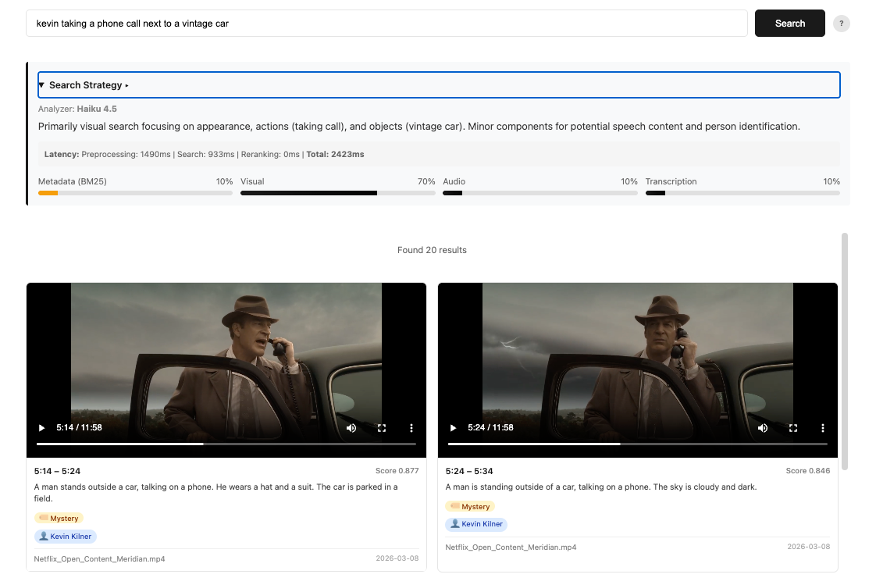
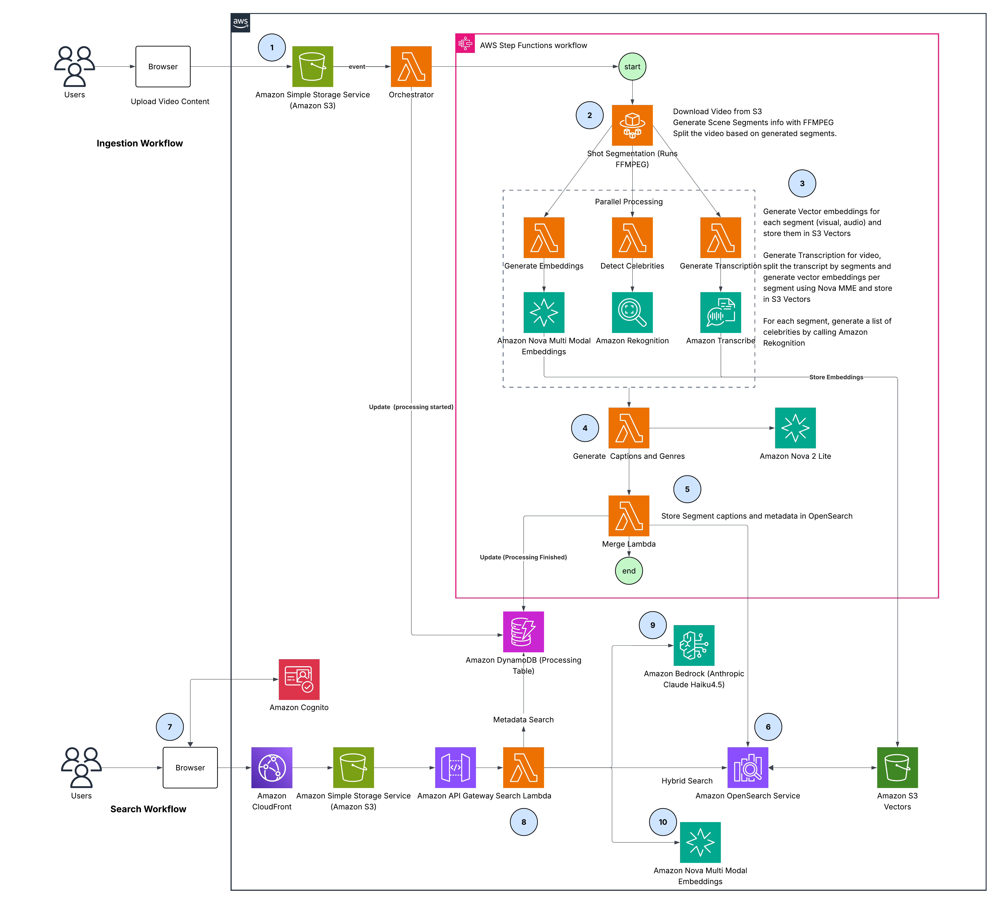
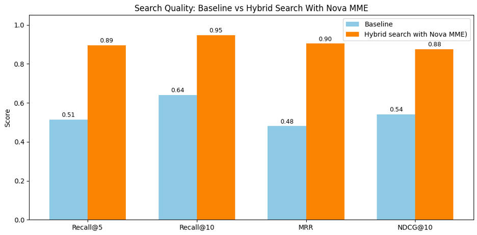
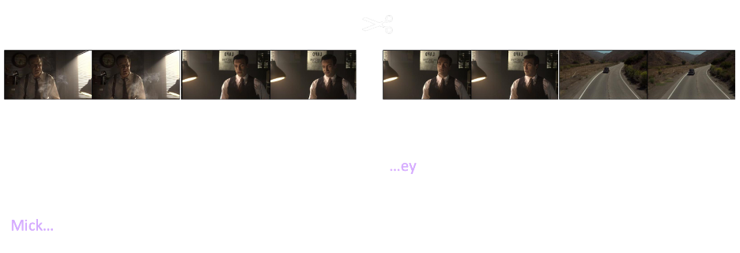
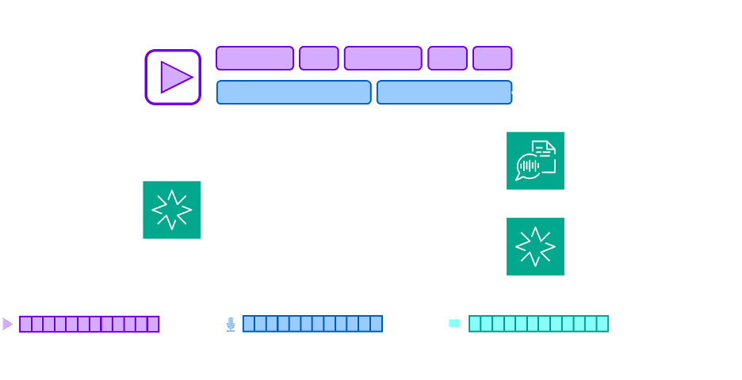

# Hybrid Video Search with Amazon Nova Multimodal Embeddings

This sample demonstrates how to build a semantic video search engine that combines OpenSearch BM25 text search with kNN vector search across visual, audio, and transcription modalities — powered by [Amazon Nova Multimodal Embeddings](https://docs.aws.amazon.com/nova/latest/userguide/multimodal-embeddings.html) and an LLM-driven query weight analyzer.



Upload a video → the pipeline segments it at scene boundaries, generates per-segment embeddings (visual + audio), transcribes speech, captions each clip, classifies genre, and detects celebrities. All of this feeds into a hybrid search index where natural language queries return the most relevant video segments, ranked by a fusion of text matching and semantic similarity.

## Table of Contents

- [Architecture](#architecture)
- [Performance Results](#performance-results)
- [Prerequisites](#prerequisites)
- [Deployment](#deployment)
- [Quick Start (Testing After Deploy)](#quick-start-testing-after-deploy)
- [Cleanup](#cleanup)
- [How It Works](#how-it-works)
  - [1. Scene-Aware Segmentation](#1-scene-aware-segmentation)
  - [2. Multi-Modal Embedding with Nova MME](#2-multi-modal-embedding-with-nova-mme)
  - [3. Metadata Generation](#3-metadata-generation)
  - [4. OpenSearch Index Structure](#4-opensearch-index-structure)
  - [5. LLM-Weighted Hybrid Search](#5-llm-weighted-hybrid-search)
  - [6. Entity Catalog and Visual Search](#6-entity-catalog-and-visual-search)
  - [7. Vector Engine Selection](#7-vector-engine-selection)
- [Performance Results](#performance-results)
- [Project Structure](#project-structure)
- [AWS Services Used](#aws-services-used)
- [Security](#security)
- [License](#license)

## Architecture



### Ingestion Workflow

1. **Upload** — Users upload video content through the browser. Files are stored in Amazon S3, which triggers the Orchestrator Lambda. The orchestrator reads video metadata from DynamoDB, updates the video status to "processing", and starts the AWS Step Functions pipeline.
2. **Shot Segmentation** — The orchestrator invokes a Lambda function that downloads the video from S3 and uses FFmpeg scene detection to split it into semantically coherent segments (shots).
3. **Parallel Processing** — Three branches execute concurrently for each segment:
   - **Generate Embeddings** — Amazon Nova Multi-Modal Embeddings (MME) generates 1024-dimensional vectors for visual and audio modalities, stored immediately in Amazon S3 Vectors.
   - **Generate Transcription** — Amazon Transcribe converts the full video's speech to text. The transcript is aligned to segment boundaries, and per-segment text embeddings are generated via Nova MME and stored in S3 Vectors.
   - **Detect Celebrities** — Amazon Rekognition identifies known individuals across the full video; celebrities are mapped to segments by timestamp in the Merge step.
4. **Generate Captions & Genre** — Amazon Nova 2 Lite synthesizes segment-level captions and genre labels using the visual content and transcription text from step 3.
5. **Merge** — The Merge Lambda assembles all metadata (captions, transcriptions, celebrity names, genre) and retrieves the vector embeddings stored in step 3 from S3 Vectors.
6. **Index** — Complete segment documents with metadata and vectors are bulk-indexed into Amazon OpenSearch Service.

### Search Workflow

7. **Authentication & Access** — Users authenticate via Amazon Cognito and access the application through Amazon CloudFront, which serves the static frontend.
8. **Hybrid Search** — The search request passes through API Gateway to the Search Lambda, which executes a hybrid query combining BM25 text matching (people, captions, titles) with per-modality kNN vector search against Amazon OpenSearch Service and Amazon S3 Vectors (acting as an external vector engine for OpenSearch). DynamoDB is queried for project and video metadata. The following two sub-steps run in parallel before the hybrid query is constructed:
   - **9. Query Weight Analysis** — Amazon Bedrock (Anthropic Claude Haiku) analyzes the query intent and assigns relevance weights (0.0–1.0) across four modalities: visual, audio, transcription, and metadata. These weights determine how much each signal contributes to the final ranking.
   - **10. Query Embedding** — The search query text is embedded three times concurrently via Amazon Nova MME — once each for visual (`GENERIC_RETRIEVAL`), audio (`GENERIC_RETRIEVAL`), and transcription (`TEXT_RETRIEVAL`) purposes — to generate per-modality vectors for kNN similarity search. OpenSearch fuses the BM25 and kNN scores using weighted min-max normalization based on the weights from step 9.

## Performance Results

We benchmarked the optimized hybrid search approach against a baseline implementation using 10 internal long-form videos (5–20 minutes each) and 20 queries spanning visual, audio, transcript, and metadata-focused searches.

**Baseline**: Nova Multimodal Embeddings with a single unified vector per 10-second segment, one index, one kNN query.

**Hybrid search with Nova MME (our optimized approach)**: Separate visual, audio, and transcript embeddings + structured metadata enrichment + intent-aware routing with dynamic modality weighting.



| Metric | Baseline | Hybrid Search w/ Nova MME | Improvement |
|--------|----------|---------------------------|-------------|
| **Recall@5** | 51% | 90% | +39 pp |
| **Recall@10** | 64% | 95% | +31 pp |
| **MRR** | 48% | 90% | +42 pp |
| **NDCG@10** | 54% | 88% | +34 pp |

**Metrics explained**:
- **Recall@5/10**: Of all relevant segments, what fraction appears in the top 5/10 results? Measures coverage.
- **MRR (Mean Reciprocal Rank)**: 1/rank of the first relevant result, averaged across queries. Measures how quickly you find something relevant.
- **NDCG@10**: Normalized Discounted Cumulative Gain rewards relevant results ranked higher. A standard ranking quality metric.

Our optimized approach delivers ~40 percentage point improvements across all metrics, validating the four core architectural decisions: semantic segmentation preserves content continuity, separate embeddings enable precise search control, metadata enrichment captures factual entities, and intent-aware routing ensures the right signals drive each query.

**Example benchmark queries**:
- `"Meridian title page appears"` — metadata + visual
- `"Picture of 3 men hanging on the wall in Meridian"` — visual + metadata
- `"Scott driving seeing a woman in the rearview mirror"` — visual + metadata
- `"Kevin taking a phone call next to a vintage car"` — visual + metadata
- `"Someone calling captain foster"` — transcription + metadata
- `"Thunder storm in the background"` — audio + visual
- `"Dark cave in Meridian"` — visual + metadata

Here is how you can deploy the solution and try it yourself.

## Prerequisites

- AWS account with [Amazon Bedrock model access](https://docs.aws.amazon.com/bedrock/latest/userguide/model-access.html) enabled for Nova MME, Nova Lite, and Claude Haiku 4.5
- [AWS CLI v2](https://docs.aws.amazon.com/cli/latest/userguide/getting-started-install.html) configured with a named profile
- [Node.js](https://nodejs.org/) ≥ 18 (for AWS CDK CLI)
- [AWS CDK](https://docs.aws.amazon.com/cdk/v2/guide/getting-started.html) v2 (`npm install -g aws-cdk`)
- [Docker](https://docs.docker.com/get-docker/) (for building the pipeline Lambda container)
- Python 3.13+ (Lambda runtime; CDK works with 3.11+)

## Deployment

Infrastructure is managed with AWS CDK (Python). From the `cdk/` directory:

```bash
cd cdk
python -m venv .venv
source .venv/bin/activate
pip install -r requirements.txt

# Preview changes
cdk diff

# Deploy everything
cdk deploy
```

CDK deploys all infrastructure (OpenSearch, Step Functions, Lambda functions, API Gateway, CloudFront, Cognito, DynamoDB, SQS), builds the Docker image for the pipeline Lambda, packages API Lambda functions, and deploys the static frontend.

**After first deploy**, create an S3 Vectors bucket manually (not yet supported by CloudFormation):

```python
import boto3
s3vectors = boto3.client('s3vectors', region_name='us-east-1')
s3vectors.create_vector_bucket(vectorBucketName='video-search-v2-vectors-<ACCOUNT_ID>')
```

### What Happens on Deploy

Deployment automatically bootstraps the app with a **demo user** and a **sample video** ([Meridian](https://en.wikipedia.org/wiki/Meridian_(film)), a 2016 short film by Netflix released under the [Creative Commons Attribution-NonCommercial-NoDerivatives 4.0 International](https://creativecommons.org/licenses/by-nc-nd/4.0/) license). The bootstrap process:

1. Creates a Cognito user (`demo@workshop.com` / `Demo1234!`)
2. Creates a "Meridian Demo" project with OpenSearch HNSW vector engine
3. Downloads and uploads the Meridian video to S3, triggering the ingestion pipeline

The pipeline runs asynchronously (~3-5 minutes). After it completes, the demo account has a fully searchable video ready to go.

Demo credentials are shown in the CDK stack outputs:

```
video-search-v2-stack.DemoUserEmail = demo@workshop.com
video-search-v2-stack.DemoUserPassword = Demo1234!
video-search-v2-stack.AppUrl = https://<STATIC_DOMAIN>.cloudfront.net
```

### Quick Start (Testing After Deploy)

1. **Log in** — open the `AppUrl` from CDK outputs and sign in with `demo@workshop.com` / `Demo1234!`.

2. **Wait for ingestion** — the "Meridian Demo" project should show the video as `completed` (if the pipeline is still running, it will show `processing` — wait a few minutes).

3. **Search** — click "Search" and try queries like:
   - `"Meridian title page appears"` — metadata + visual
   - `"Scott driving seeing a woman in the rearview mirror"` — visual + metadata
   - `"Kevin taking a phone call next to a vintage car"` — visual + metadata
   - `"Someone calling captain foster"` — transcription + metadata
   - `"Thunder storm in the background"` — audio + visual
   - `"Dark cave in Meridian"` — visual + metadata

4. **Upload your own videos** — click "Upload Video" to add more content. Processing takes a few minutes per video.

5. **Create new projects** — click the back arrow, then "New Project" to start fresh with your own project settings.

### Additional Users

To create additional users in the Cognito User Pool, use the AWS CLI. The app uses the `USER_AUTH` flow, which does not support the `FORCE_CHANGE_PASSWORD` challenge — so you must set a permanent password immediately:

```bash
# Step 1: Create user with temporary password
aws cognito-idp admin-create-user \
  --user-pool-id <POOL_ID> \
  --username user@example.com \
  --temporary-password 'TempPass@123' \
  --user-attributes Name=email,Value=user@example.com Name=email_verified,Value=true \
  --message-action SUPPRESS \
  --region us-east-1

# Step 2: Set a permanent password (required — USER_AUTH rejects temp passwords)
aws cognito-idp admin-set-user-password \
  --user-pool-id <POOL_ID> \
  --username user@example.com \
  --password 'YourPassword1!' \
  --permanent \
  --region us-east-1
```

Password requirements: minimum 8 characters, with uppercase, lowercase, numbers, and symbols.

## Cleanup

**1. Delete the S3 Vectors bucket** (not managed by CloudFormation):

```python
import boto3
client = boto3.client('s3vectors', region_name='us-east-1')
bucket = 'video-search-v2-vectors-<ACCOUNT_ID>'
for idx in client.list_indexes(vectorBucketName=bucket).get('indexes', []):
    client.delete_index(vectorBucketName=bucket, indexName=idx['indexName'])
client.delete_vector_bucket(vectorBucketName=bucket)
```

**2. Destroy the CDK stack:**

```bash
cd cdk
source .venv/bin/activate
cdk destroy
```

The access logs bucket will likely fail deletion because it contains log objects. If `cdk destroy` fails, empty the bucket and retry:

```bash
# Get the bucket name from the error message, then:
aws s3 rm s3://<ACCESS_LOGS_BUCKET> --recursive --region us-east-1
aws cloudformation delete-stack --stack-name video-search-v2-stack --region us-east-1
aws cloudformation wait stack-delete-complete --stack-name video-search-v2-stack --region us-east-1
```

**3. Delete retained resources** — CDK retains the OpenSearch domain and Cognito user pool to prevent accidental data loss. Delete them manually after stack destruction:

```bash
# Delete OpenSearch domain (can take 20-30 minutes)
aws opensearch delete-domain --domain-name <DOMAIN_NAME> --region us-east-1

# Delete Cognito user pool
aws cognito-idp delete-user-pool --user-pool-id <POOL_ID> --region us-east-1
```

> **Tip:** Find the OpenSearch domain name with `aws opensearch list-domain-names --region us-east-1` and the Cognito pool ID with `aws cognito-idp list-user-pools --max-results 10 --region us-east-1`.


## How It Works

### 1. Scene-Aware Segmentation

Videos need to be split into segments for embedding and captioning. Naive fixed-duration cuts (every 10 seconds) often split mid-sentence or mid-action. Scene-aware segmentation aligns segment boundaries to visual transitions so cuts feel natural.



**Scene detection** uses FFmpeg's `scene` filter, which compares consecutive frames and outputs a score (0.0–1.0) representing how different they are. A threshold of 0.3 catches hard cuts, fades, and major camera movements while ignoring minor motion:

```python
# shot_segmentation_function.py

SCENE_THRESHOLD = 0.3

def _detect_scenes(video_path):
    """Use ffmpeg scene filter to find visual transition timestamps."""
    result = subprocess.run(
        ['ffprobe', '-v', 'quiet', '-show_entries', 'frame=pts_time', '-of', 'csv=p=0',
         '-f', 'lavfi', f"movie={video_path},select='gt(scene\\,{SCENE_THRESHOLD})'"],
        capture_output=True, text=True
    )
    return sorted([float(line) for line in result.stdout.strip().split('\n') if line])
```

**Smart segment building** walks through the video and snaps each cut to the nearest scene change within an acceptable window. Each segment must be at least 4 seconds (long enough for meaningful embeddings) and at most 1.5× the target duration:

```python
def _build_smart_segments(scene_changes, video_duration, target_duration=10, min_dur=4, max_dur=15):
    segments = []
    current_start = 0.0

    while current_start < video_duration - 1.0:
        ideal_end = current_start + target_duration

        # Find scene changes in acceptable window
        candidates = [t for t in scene_changes
                      if current_start + min_dur <= t <= current_start + max_dur]

        if candidates:
            # Snap to scene change closest to ideal end
            seg_end = min(candidates, key=lambda t: abs(t - ideal_end))
        else:
            # No scene change nearby — hard cut at target
            seg_end = current_start + target_duration

        seg_end = min(seg_end, video_duration)
        segments.append({
            'segment_index': len(segments),
            'start_sec': round(current_start, 2),
            'end_sec': round(seg_end, 2)
        })
        current_start = seg_end

    return segments
```

A 10-minute documentary might produce segments of 8.3s, 11.1s, 9.8s, 12.4s, 7.6s — instead of uniform 10s blocks. Clips are extracted via `ffmpeg -c copy` (stream copy, no re-encoding) making extraction nearly instant.

### 2. Multi-Modal Embedding with Nova MME

Each video clip is embedded through Amazon Nova Multimodal Embeddings using the `AUDIO_VIDEO_SEPARATE` mode, which produces two independent 1024-dimensional vectors per clip — one for visual content and one for audio:

```python
# embedding_function.py

def _embed_clip(clip_uri, video_format='mp4'):
    """Call Nova MME sync API for a single clip."""
    response = bedrock.invoke_model(
        modelId='amazon.nova-2-multimodal-embeddings-v1:0',
        body=json.dumps({
            'taskType': 'SINGLE_EMBEDDING',
            'singleEmbeddingParams': {
                'embeddingPurpose': 'GENERIC_INDEX',
                'embeddingDimension': 1024,
                'video': {
                    'format': video_format,
                    'embeddingMode': 'AUDIO_VIDEO_SEPARATE',
                    'source': {'s3Location': {'uri': clip_uri}},
                },
            },
        }),
    )
    result = json.loads(response['body'].read())

    embeddings = {}
    for emb in result.get('embeddings', []):
        if emb['embeddingType'] == 'VIDEO':
            embeddings['visual'] = emb['embedding']
        elif emb['embeddingType'] == 'AUDIO':
            embeddings['audio'] = emb['embedding']
    return embeddings
```

Why separate visual and audio embeddings instead of a single fused one? Because search queries have different intents. "Red car driving" is purely visual — the audio embedding would add noise. "Dog barking loudly" is primarily audio. Keeping them separate lets the search pipeline weight each modality independently per query.



At search time, text queries are embedded with modality-specific purposes:

```python
# search_engine.py — query embedding

embed_futs = [
    pool.submit(_safe_embed, query, 'visual', 'GENERIC_RETRIEVAL'),
    pool.submit(_safe_embed, query, 'audio', 'GENERIC_RETRIEVAL'),
    pool.submit(_safe_embed, query, 'transcription', 'TEXT_RETRIEVAL'),
]
```

Visual and audio use `GENERIC_RETRIEVAL` (broad semantic matching), while transcription uses `TEXT_RETRIEVAL` (optimized for matching spoken/written text). All three embeddings are generated concurrently.

### 3. Metadata Generation

Each video clip is captioned individually using Nova Lite with the actual video as input (not extracted frames), giving the LLM temporal context for actions and transitions. Captions serve dual purposes: displayed in search results AND indexed in OpenSearch for BM25 text search.

```python
# caption_function.py

CAPTION_PROMPT = """Describe this video clip in 3-5 sentences. Include:
- What is happening, who is visible, actions, setting, and environment
- Any text on screen: titles, subtitles, signs, logos, watermarks, or credits
- If the screen is mostly black or blank, state "Black frame" or "Blank screen"
- If showing opening/closing credits or title cards, describe them as such
{transcription}
Return ONLY the descriptive caption, nothing else."""
```

When AWS Transcribe has produced text for a segment, it's injected via `{transcription}` so Nova Lite can reference what was said without needing to do its own speech recognition.

After all segments are captioned, a second LLM call classifies the entire video into one genre by feeding all segment captions into a single prompt. Genre is stored in OpenSearch as a keyword field, so BM25 can match on it directly.

Celebrity detection runs in parallel via Amazon Rekognition. Detected names are mapped to segments by timestamp overlap and stored in the `people` text field — enabling partial name searches (e.g., searching "kevin" matches "Kevin Kilner").

### 4. OpenSearch Index Structure

Each video segment becomes a single OpenSearch document containing both text fields (for BM25) and vector fields (for kNN). The vector engine is configurable per project — S3 Vectors offloads storage to S3 while nmslib HNSW stores vectors directly in the index:

```python
# opensearch_client.py — index schema

def _index_settings(dimension=1024, vector_engine='s3_vectors'):
    if vector_engine == 'opensearch':
        method = {"engine": "nmslib", "name": "hnsw",
                  "parameters": {"ef_construction": 256, "m": 16}}
    else:
        method = {"engine": "s3vector"}

    vec_field = {
        "type": "knn_vector",
        "dimension": dimension,
        "space_type": "cosinesimil",
        "method": method
    }
    return {
        "settings": {"index": {"knn": True}},
        "mappings": {
            "properties": {
                "caption":              {"type": "text", "analyzer": "english"},
                "people":               {"type": "text"},
                "genre":                {"type": "keyword"},
                "upload_date":          {"type": "date"},
                "visual_vector":        vec_field,
                "audio_vector":         vec_field,
                "transcription_vector": vec_field,
                # ... video_id, segment_id, start_sec, end_sec
            }
        }
    }
```

Vectors are stored in S3 Vectors during the parallel processing phase (by the Embeddings and Transcription Lambdas). The Merge Lambda then reads them back and assembles the final OpenSearch document:

```python
# merge_function.py — building the OpenSearch document

doc = {
    'video_id': video_id,
    'segment_id': f"seg_{idx:04d}",
    'caption': caption_map.get(idx, ''),          # BM25 searchable
    'people': sorted(celeb_by_seg.get(idx, set())), # BM25 searchable (text)
    'genre': genre,                                 # BM25 searchable (keyword)
    'upload_date': today,
    'start_sec': seg['start_sec'],
    'end_sec': seg['end_sec'],
}
# Attach vectors for kNN search
for field in ['visual_vector', 'audio_vector', 'transcription_vector']:
    if field in vecs:
        doc[field] = vecs[field]
```

### 5. LLM-Weighted Hybrid Search

The core insight: different queries need different search strategies. "Red car driving" should rely almost entirely on visual similarity, while "Werner Vogels" should use BM25 keyword matching on the `people` field. Instead of fixed weights, an LLM analyzes each query and assigns weights to four modalities:

```python
# prompt_analyzer.py — query weight analysis

SYSTEM_MESSAGE = """Analyze video search queries and assign weights (0.0-1.0).
Weights must sum to 1.0. Return ONLY valid JSON:
{
  "visual": 0.0, "audio": 0.0, "transcription": 0.0, "metadata": 0.0,
  "reasoning": "brief explanation"
}

Weight assignment rules:
1. When a query contains ANY proper noun or named entity, metadata should be 0.4.
   BM25 keyword matching is the only way to match names and titles.
2. Only assign audio weight for non-speech sounds, music, or acoustic qualities.
3. Assign transcription weight only for spoken words or dialogue content.

Weight patterns (follow these strictly):
- Pure visual, no names: "red car driving fast" → visual=1.0
- Visual + a name/title: "car chase in [name]" → metadata=0.5, visual=0.4, transcription=0.1
- Person doing something: "[Person] scores a goal" → metadata=0.3, visual=0.6, transcription=0.1
- Speech content: "talking about climate change" → transcription=0.5, visual=0.2, audio=0.1, metadata=0.2
- Sound-focused: "loud explosion sound" → audio=0.7, visual=0.3"""
```

The search pipeline runs in three phases:

**Phase 1 — Parallel preprocessing.** Weight analysis and embedding generation run concurrently, cutting latency roughly in half:

```python
# search_engine.py

with concurrent.futures.ThreadPoolExecutor(max_workers=4) as pool:
    analyze_fut = pool.submit(analyze_query_weights, query, analyzer_model_id)
    embed_futs = [
        pool.submit(_safe_embed, query, 'visual', 'GENERIC_RETRIEVAL'),
        pool.submit(_safe_embed, query, 'audio', 'GENERIC_RETRIEVAL'),
        pool.submit(_safe_embed, query, 'transcription', 'TEXT_RETRIEVAL'),
    ]
```

**Phase 2 — Hybrid query construction.** Modalities below 5% weight are dropped entirely — no embedding API call, no kNN sub-query — saving both latency and cost:

```python
# Drop inactive modalities
vectors = {m: v for m, v in vectors.items() if weights_data.get(m, 0) >= 0.05}
```

**Phase 3 — OpenSearch hybrid query with inline score normalization.** Up to 4 sub-queries (1 BM25 + 3 kNN) execute in a single request. The critical challenge is that BM25 scores (0.5–15.0) and kNN cosine similarity (0.0–1.0) are on completely different scales. Without normalization, whichever scoring system produces larger numbers would dominate:

```python
# opensearch_client.py — hybrid search with score fusion

# BM25 sub-query with field boosting
queries = [{"multi_match": {
    "query": query_text,
    "fields": ["people^5", "caption", "title^5"],
    "type": "best_fields", "fuzziness": "AUTO"
}}]

# kNN sub-queries per active modality
for modality in ['visual', 'audio', 'transcription']:
    if modality in vectors and weights[i + 1] >= 0.05:
        queries.append({"knn": {
            f"{modality}_vector": {"vector": vectors[modality], "k": k}
        }})

# Inline normalization pipeline
body = {
    "query": {"hybrid": {"queries": queries}},
    "search_pipeline": {
        "phase_results_processors": [{
            "normalization-processor": {
                "normalization": {"technique": "min_max"},
                "combination": {
                    "technique": "arithmetic_mean",
                    "parameters": {"weights": active_weights}
                }
            }
        }]
    }
}
```

The normalization pipeline works in two steps:

1. **Min-Max Normalization** — Each sub-query's scores are independently scaled to \[0, 1\]. The lowest-scoring result becomes 0.0 and the highest becomes 1.0.

2. **Weighted Arithmetic Mean** — The normalized scores are combined using the LLM-assigned weights. If a document appears in multiple sub-query results, its final score reflects all matching modalities.

For example, with query "Werner Vogels talking about serverless":
- LLM assigns: `metadata=0.4, visual=0.1, transcription=0.4, audio=0.1`
- A segment where Werner is speaking about serverless scores high on both BM25 (name match in `people^5`) and transcription kNN (semantic match on "serverless")
- A segment showing Werner but discussing databases scores high on BM25 but low on transcription kNN, so it ranks lower

### 6. Entity Catalog and Visual Search

The entity catalog lets you define visual entities — a specific person, object, or logo — by uploading a reference image. Nova MME generates a 1024d image embedding that captures the entity's visual appearance. At search time, the `@entity_name` syntax triggers visual similarity matching against every video segment.

**Creating an entity** is a three-step flow:

```python
# entity_function.py — create entity with image embedding

# Step 1: Create entity record, return presigned upload URL
image_key = f"entities/{project_id}/{entity_id}.jpg"
upload_url = s3.generate_presigned_url('put_object', Params={
    'Bucket': S3_VIDEO_BUCKET, 'Key': image_key, 'ContentType': 'image/jpeg',
}, ExpiresIn=300)

# Step 2: Client uploads image directly to S3 via presigned URL

# Step 3: Generate image embedding with Nova MME
from nova_embeddings import generate_image_embedding_nova
embedding = generate_image_embedding_nova(f"s3://{S3_VIDEO_BUCKET}/{image_key}")

# Store 1024d vector in S3 Vectors entity index
s3vectors.put_vectors(
    vectorBucketName=S3_VECTOR_BUCKET,
    indexName=f'nova-entity-{project_id}',
    vectors=[{'key': entity_id, 'data': {'float32': embedding}}]
)
```

**Searching with `@entity_name`** works in two modes:

| Query | Behavior |
|---|---|
| `@main_speaker` | Pure visual kNN — entity image embedding as the search vector, no BM25 |
| `@main_speaker talking about cloud` | Normal hybrid search on "talking about cloud", then **post-sort rerank** using entity visual similarity |

The combined search uses a post-sort rerank strategy rather than injecting the entity embedding into the search query. This keeps the hybrid search pipeline clean and composable:

```python
# search_engine.py — entity rerank (post-sort)

def _entity_rerank(results, entity_emb, project_id, blend=0.5):
    """Re-rank by blending search score with entity visual similarity."""
    # Fetch each result's visual vector from S3 Vectors
    keys = [f"{r['video_id']}_seg{r['segment_index']:04d}_visual" for r in results]
    resp = s3v.get_vectors(vectorBucketName=bucket, indexName=index, keys=keys, returnData=True)

    for r in results:
        vis_vec = vec_map.get(key)
        if vis_vec:
            sim = _cosine_sim(entity_emb, vis_vec)
            # Blend: 50% search relevance + 50% entity visual similarity
            r['combined_score'] = (1 - blend) * r['combined_score'] + blend * sim

    results.sort(key=lambda r: r['combined_score'], reverse=True)
```

Why post-sort instead of injecting the entity embedding into the kNN query? Because the hybrid search already optimizes for the text query's intent — the LLM assigns weights, BM25 matches metadata, kNN matches semantics. The entity embedding is a separate signal ("does this segment visually contain this entity?") that should adjust ranking without distorting the search pipeline's weight balance.

### 7. Vector Engine Selection

Each project can choose between two vector storage engines at creation time:

| Engine | How it works | Tradeoff |
|---|---|---|
| **S3 Vectors** (default) | Vectors stored in S3, referenced by OpenSearch via `s3vector` engine | Lighter cluster, vectors scale independently, slightly higher search latency |
| **OpenSearch nmslib** | Vectors stored in-memory on OpenSearch nodes via HNSW graph | Faster kNN search (no external fetch), but heavier cluster (vectors consume RAM) |

The ingest pipeline is identical for both — S3 Vectors is always used as staging during video processing. The only difference is the OpenSearch index mapping:

```python
# opensearch_client.py — engine selection at index creation

def _index_settings(dimension=1024, vector_engine='s3_vectors'):
    if vector_engine == 'opensearch':
        method = {"engine": "nmslib", "name": "hnsw",
                  "parameters": {"ef_construction": 256, "m": 16}}
    else:
        method = {"engine": "s3vector"}
```

With S3 Vectors, OpenSearch delegates vector storage and kNN computation to S3. With nmslib, OpenSearch builds an in-memory HNSW graph for approximate nearest neighbor search — trading cluster resources for lower query latency.

The vector engine is set at project creation and cannot be changed after (the OpenSearch index mapping is immutable). Entity embeddings always use S3 Vectors regardless of the project's engine choice.

## Project Structure

```
├── lambda/functions/            # Lambda handlers
│   ├── shot_segmentation_function.py  # FFmpeg scene detection + clip extraction
│   ├── embedding_function.py          # Nova MME video embeddings (visual + audio)
│   ├── transcription_function.py      # AWS Transcribe → per-segment text
│   ├── caption_function.py            # Nova Lite captions + genre classification
│   ├── celebrity_detection_function.py # Rekognition celebrity recognition
│   ├── merge_function.py              # Combine all outputs → OpenSearch + S3 Vectors
│   ├── orchestrator_function.py       # S3 trigger → Step Functions
│   ├── search_function.py             # Hybrid search API endpoint
│   ├── entity_function.py             # Entity CRUD + image embedding
│   ├── project_function.py            # Project CRUD
│   └── bootstrap_function.py          # CDK custom resource: demo user + sample video
├── lib/                         # Shared library (Lambda layer)
│   ├── search_engine.py               # Hybrid search pipeline
│   ├── opensearch_client.py           # OpenSearch hybrid query builder
│   ├── nova_embeddings.py             # Nova MME embedding generation
│   ├── vector_store.py                # S3 Vectors operations
│   ├── prompt_analyzer.py             # LLM query weight analysis
│   └── dynamodb_store.py              # DynamoDB operations
├── cdk/                         # AWS CDK infrastructure (Python)
│   ├── stacks/                        # Main stack definition
│   └── components/                    # Modular constructs (storage, compute, search, etc.)
├── frontend-static/             # Vanilla JS SPA (no build step)
└── deployment/                  # Dockerfile for pipeline Lambda container
```

## AWS Services Used

| Service | Purpose |
|---|---|
| **Amazon Bedrock** | Nova MME (1024d embeddings), Nova Lite (captions), Haiku (query analysis) |
| **Amazon OpenSearch** | Hybrid BM25 + kNN search with configurable vector engine (S3 Vectors or nmslib HNSW) |
| **Amazon S3 Vectors** | Per-project vector storage and staging (visual, audio, transcription, entity indices) |
| **AWS Step Functions** | Video processing pipeline with parallel branches |
| **AWS Lambda** | 10 functions (API + pipeline), Docker container for ffmpeg |
| **Amazon Rekognition** | Celebrity detection |
| **Amazon Transcribe** | Speech-to-text with word-level timestamps |
| **Amazon DynamoDB** | Projects, videos, segments metadata |
| **Amazon CloudFront + S3** | Static site hosting and video delivery CDN |
| **Amazon Cognito** | User authentication |

## Security

See [CONTRIBUTING](CONTRIBUTING.md#security-issue-notifications) for more information.

## License

This library is licensed under the MIT-0 License. See the [LICENSE](LICENSE) file.
